# 🛡️ DataGuard Pro - AI-Powered Data Protection Compliance Assistant

An agentic voice-controlled tool for Data Protection Officers to evaluate potential GDPR violations against precedent and statutory law.

Built for the [{Tech: Europe} Hackathon Berlin 25](https://techeurope.notion.site/berlin-hackathon-manual) 🚀

## 📑 Table of Contents
1. 🎯 Overview
2. 💡 Motivation
3. 🏆 Hackathon Tracks
4. 🔄 Agentic Flow
5. 📊 Data Sources
6. 🛠️ Technology Stack
7. 🚀 Features
8. 📋 Installation & Setup
9. 🎤 Usage

## 🎯 Overview
DataGuard Pro is an intelligent voice-controlled assistant designed specifically for Data Protection Officers (DPOs) and legal professionals dealing with GDPR compliance. The system combines statutory law analysis with precedent-based assessment to provide comprehensive evaluations of potential data protection violations.

## 💡 Motivation
In today's data-driven world, organizations face increasing scrutiny regarding their data protection practices. Data Protection Officers need quick, accurate, and comprehensive tools to:

- Assess potential GDPR violations against both statutory requirements and real-world precedents
- Predict financial impact based on historical enforcement data
- Access relevant case law efficiently through intelligent search capabilities
- Make informed decisions about compliance strategies and risk mitigation

Traditional approaches require manual research through countless legal documents and enforcement databases. DataGuard Pro automates this process, providing DPOs with instant access to relevant precedents, statutory analysis, and financial impact predictions through natural voice interaction.

## 🏆 Hackathon Tracks

**🎙️ Track 2: Voice Agents powered by telli**

We're building a sophisticated voice-controlled AI agent that autonomously handles complex GDPR compliance assessments from start to finish. Our agent:

- Voice Interface: Natural language understanding for describing data breach scenarios
- Task Execution: Complete end-to-end GDPR violation assessment workflows
- Integration: Connects with multiple APIs (OpenAI, Weaviate, ElevenLabs, ai|coustics)
- Autonomy: Makes intelligent decisions, handles complex legal analysis, and guides users through compliance assessment

**🌟 Track 1: Open Innovation**
Our project represents a novel approach to legal-tech innovation, combining:

- AI-powered legal analysis with voice interaction
- Precedent-based risk assessment using vector databases
- Multi-modal agent orchestration for complex legal workflows
- Real-world impact in the critical domain of data protection compliance

**🔊 Side Challenge: Best Use of ai|coustics**

We leverage ai|coustics' powerful AI-Enhancement API to:

- Clean and enhance voice input from users describing breach scenarios
- Improve transcription accuracy for legal terminology and technical descriptions
- Ensure reliable voice interaction in professional legal environments

## 🔄 Agentic Flow

```mermaid
flowchart TD
    A[🎤 Voice Input] --> B[🔊 ai&#124;coustics Enhancement]
    B --> C[📝 Speech Recognition]
    C --> D[🤖 Main Agent Controller]
    
    D --> E[👋 Onboarding Flow]
    E --> F{Information Complete?}
    F -->|No| G[❓ Ask Follow-up Questions]
    G --> E
    F -->|Yes| H[🔀 Parallel Processing]
    
    H --> I[⚖️ Statutory Assessment Flow]
    H --> J[📚 Precedent Analysis Flow]
    
    I --> K[📊 GDPR Article Analysis]
    K --> L[🎯 Risk Classification]
    L --> M[📋 Compliance Report]
    
    J --> N[🔍 Vector Search Weaviate]
    N --> O[📑 Top 5 Precedents]
    O --> P[🤖 Precedent Analysis Agent]
    P --> Q[📈 Similarity Scoring]
    Q --> R[💰 Fine Calculation]
    
    M --> S[🔗 Results Synthesis]
    R --> S
    S --> T[📊 Final Assessment]

    
    style A fill:#e1f5fe
    style I fill:#fff3e0
    style J fill:#f3e5f5

```

## 📊 Data Sources

**🌐 Enforcement Tracker Data**
We utilize comprehensive GDPR enforcement data from enforcementtracker.com, enhanced with:

- Violation Classifications: Custom labeling system for different types of GDPR breaches
- Financial Context: Revenue information for each sanctioned company
- Precedent Categories: Structured classification of violation types and circumstances

**📄 Case Documentation**

- PDF Processing: Automated extraction and chunking of full case documents
- Vector Embeddings: Semantic search capabilities through Weaviate integration
- Hybrid Search: Combining keyword and semantic search for precise precedent matching

**📈 Enhanced Metadata**

- Company Revenue Data: For accurate fine-to-revenue ratio calculations

## 🛠️ Technology Stack

**🎯 AI & ML Infrastructure**

- OpenAI GPT-4: Advanced language understanding and legal analysis
- Weaviate: Vector database for semantic search of legal precedents
- ai|coustics: AI-powered audio enhancement for voice input

**🎵 Voice & Audio**

- ElevenLabs: High-quality text-to-speech synthesis

**💾 Data & Backend**

- SQLite: Structured storage for GDPR fines and case metadata
- Python: Core backend processing and agent orchestration
- Pandas: Data manipulation and analysis

**🖥️ Frontend & Interface**

- React + TypeScript: Modern web interface
- Tailwind CSS: Responsive, professional UI design
- Voice-First Design: Optimized for audio interaction

## 🚀 Features

**🎤 Voice-First Interaction**
- Natural language case description input
- Real-time audio enhancement via ai|coustics
- Professional text-to-speech responses

**⚖️ Comprehensive Legal Analysis**
- Statutory Assessment: Analysis against key GDPR articles (5, 6, 13, 17, 25, 32, 33, 34, 35, 44)
- Precedent Matching: Intelligent search through 1000+ enforcement cases
- Risk Classification: Automated risk level assessment (High/Medium/Low)

**💰 Financial Impact Prediction**
- Fine Estimation: Data-driven predictions based on similar cases
- Revenue Context: Company size and sector-specific considerations

**📊 Detailed Reporting**
- GDPR Compliance Dashboard: Article-by-article risk assessment
- Precedent Summary: Top 5 most relevant cases with similarity scoring

## 📋 Installation & Setup
**Prerequisites**

- Python 3.10+
- Node.js 18+
- API Keys for: OpenAI, ElevenLabs, Weaviate, ai|coustics, weaviate database

### 🚀 Start up
**Starting the backend api**

In the root folder of the project 
<code>cd backend</code> 
<code>uvicorn main:app --reload --port 5000</code>

**Starting the main application**

In the root folder of the project 
<code>cd frontend</code> 
<code>npm run dev</code>

### 🎤 Usage
Voice Interaction Flow
1. 🎙️ Describe the Incident: Speak naturally about your data protection concern
2. 🤖 AI Enhancement: ai|coustics automatically cleans and optimizes your audio
3. ❓ Guided Questions: The system asks clarifying questions as needed
4. ⚡ Parallel Analysis: Simultaneous statutory and precedent analysis
5. 📊 Comprehensive Report: Detailed assessment with actionable recommendations in modern UI

> Built with ❤️ for the {Tech: Europe} Hackathon Berlin 25
